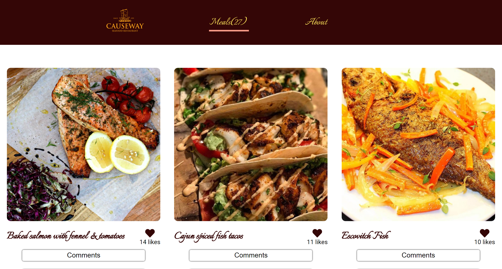
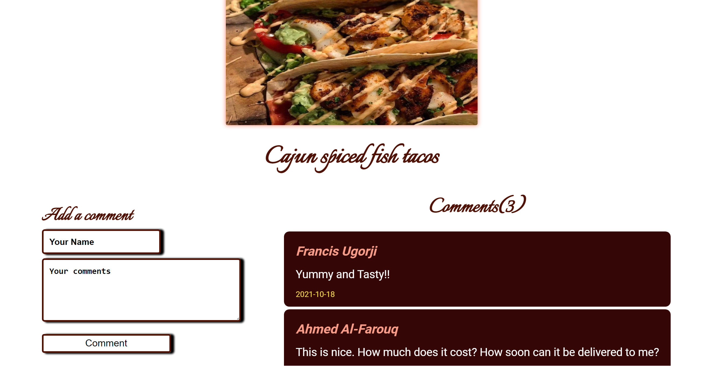

# Javascript Capstone

> This website is a Seafood Restaurant that showcases different seafood meals to users.

> |Home Page       |Modal Window|
> |--------------|--------------|
> |.|| 

> You will find all kinds of Seafood meals here and for every meal, users can like the meals by clicking the heart icon. When a user clicks the comment button, a modal appears and he/she can add comments.

## Built With

- HTML, CSS
- JS & ECMA 6
- Webpack
- Linters (eslint, stylelint, hint)
- Jest (for testing)

## Live Demo

[Live Demo Link](https://ahmed-al-farouq.github.io/Javascript-capstone/)

## Getting Started
  * To get a clone
    * Open your command
    * Type "git clone https://github.com/ahmed-al-farouq/Javascript-capstone.git"

### Prerequisites
  #### Knowledge of these technologies
  * HTML, CSS
  * JS & ECMA 6
  * Webpack
  * Jest for testing
### Setup
  * Open your command
  * Type "git clone https://github.com/ahmed-al-farouq/Javascript-capstone.git"
  * npm i
  * npm run start
### Install
  * Open command
  * npm i
### Run tests
  * npm run test

### Deployment
  * npm run build

## Authors

:bearded_person::skin-tone-6: **Francis Ugorji**

- GitHub: [@github](https://github.com/Gambit142)
- LinkedIn: [LinkedIn](www.linkedin.com/in/francis-ugorji-a567b7168)

:bearded_person: **Ahmed Al-Farouq**
  - Github: [@Ahmed-Alfarouq](https://github.com/ahmed-al-farouq)
  - LinkedIn: [LinkedIn](https://www.linkedin.com/in/ahmed-al-farouq/)
  - Twitter: [@twitter](https://twitter.com/ahmed_al_farouq)

## 🤝 Contributing

Contributions, issues, and feature requests are welcome!

Feel free to check the [issues page](../../issues/).

## Show your support

Give a ⭐️ if you like this project!

## Acknowledgments

- **``Microverse``** for the opportunity to underatake such project using their platform
- To family and friends who motivated us throughout this project
- [themealdb](https://themealdb.com/api/json/v1/1/filter.php?c=Seefood)
- [Involvement API Service](https://www.notion.so/microverse/Involvement-API-869e60b5ad104603aa6db59e08150270) for granting me permission to fetch data from their site.
- [Dreamstime.com](https://www.dreamstime.com/stock-illustration-seafood-logo-design-modern-vintage-modern-image94678741) for the logo used in the project

